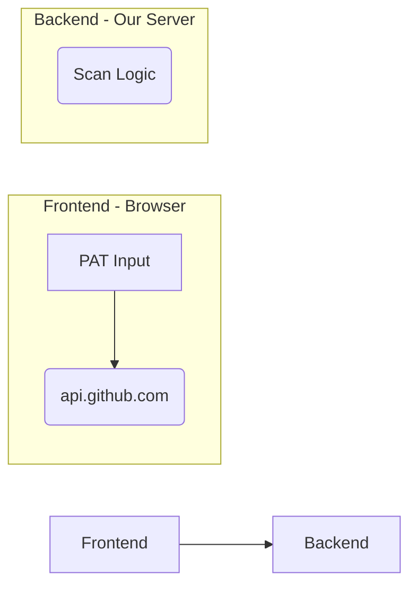

# Public Repo Secret Hunter

This is a full-stack application (FastAPI + React) built to scan public GitHub repositories for potential secrets. It allows a user to search for a repository, scan its files using a set of heuristics, and (if findings are present) create a GitHub issue to alert the maintainers.

This project was built to demonstrate a production-ready, test-driven, and well-documented approach to software development.

**Core Documents:**

* [`docs/blueprint.md`](./docs/blueprint.md) - The overall system plan.
* [`docs/backend_architecture.md`](./docs/backend_architecture.md) - Deep-dive into the backend design.
* [`docs/frontend_architecture.md`](./docs/frontend_architecture.md) - Deep-dive into the frontend design.

---

## 🚀 Core Features

* **Search:** Search the GitHub API for public repositories by keyword.
* **Scan:** Perform a deep scan of a repository's files. The backend uses a layered detection engine (regex, entropy, keywords) to find potential secrets.
* **Graceful Rate-Limit Handling:** If the 60-request/hour unauthenticated limit is hit, the UI gracefully catches the 429 error and prompts the user to add a Personal Access Token (PAT) to continue with a 5,000-request/hour limit.
* **Report:** If secrets are found, the user can create a GitHub issue on the target repo. This is done **100% on the frontend**; the user's PAT never touches our backend server.

## 🛠️ Tech Stack

| Area | Technology |
| :--- | :--- |
| **Backend** | Python, FastAPI, Pydantic, `httpx`, `asyncio` |
| **Frontend** | React, TypeScript, Vite, `zustand`, `react-router-dom` |
| **Testing** | `pytest` (Backend) |

---

## ⚙️ How to Run It Locally

### Prerequisites

* Python 3.10+ and `venv`
* Node.js 18+ and `npm`

### 1. Backend Server (FastAPI)

```bash
# From the project root, navigate to the backend
cd backend

# Create a virtual environment
python3 -m venv .venv

# Activate the venv (OS-specific)
# See official Python docs for your OS: 
# [https://docs.python.org/3/tutorial/venv.html](https://docs.python.org/3/tutorial/venv.html)
#
# e.g., on macOS/Linux:  source .venv/bin/activate
# e.g., on Windows CMD:   .venv\Scripts\activate.bat

# Install dependencies
pip install -r requirements.txt

# ---
# From the project ROOT directory, run the server
# (Run from the root so that package imports work)
# ---
cd .. 
uvicorn backend.main:app --reload --port 8000
```

The backend API will be running at `http://127.0.0.1:8000`.

### 2. Frontend Client (React)

```bash
# Open a new terminal
# From the project root, navigate to the frontend
cd frontend

# Install dependencies
npm install

# Run the development server
npm run dev
```

The frontend will be running at `http://localhost:5173`.

---

## 📖 How to Use

1. **Search**: Open `http://localhost:5173`. Enter a repository name or keyword (e.g., "tech-test-scannable-repo") in the search bar.
2. **Select**: Choose a repository from the search results to navigate to the Scan page.
3. **Scan**: The scan will begin automatically.
      * If you hit a rate limit, the app will prompt you to add a GitHub PAT to continue.
4. **Review**: Examine the table of findings, which includes the file path, line number, snippet (redacted), and confidence level.
5. **Report** (Optional): If secrets are found, click the "Report Findings" button. Paste a GitHub PAT (with `public_repo` scope) into the modal to create an issue on the repository.

---

## 🧪 How to Run Tests

### Backend Tests

Our backend includes **19 tests** covering both core detector logic and API endpoint behavior.

```bash
# From the project root, with the backend .venv active
source backend/.venv/bin/activate

# Run pytest
pytest
```

---

## 🏗️ Key Design Decisions

This project was built with several key, defensible decisions.

### 1. Security: Frontend-to-GitHub Issue Creation

Our **most important security decision** was to *never* let a user's Personal Access Token (PAT) for issue creation touch our backend.



The frontend client sends the PAT directly to the GitHub API. This completely isolates our backend from that powerful credential, drastically reducing our security liability.

### 2. Rate-Limit Handling: The Interactive 429

We hit the unauthenticated 60-request/hour limit quickly. Instead of just failing or hanging, we built an end-to-end solution:

1. **Backend (`github_client`)** reacts to 403/429 errors and reads the `Retry-After` header.
2. **Backend (`main.py`)** catches a `RateLimitExceededError` and sends a custom 429 JSON response containing the `resetAt` timestamp.
3. **Frontend (`useScanStore`)** saves this error state.
4. **Frontend (`ScanPanel`)** renders a special `RateLimitPanel` component.
5. **Frontend (`RateLimitPanel`)** gives the user two choices:
    * Wait for the timer to count down.
    * Enter their *own* PAT to instantly "upgrade" their session to 5,000 requests/hour and retry the scan.

### 3. Detection Engine: Layered Heuristics

We don't just "grep" for secrets. Our `detectors.py` module uses a multi-layer approach to find high-confidence results and reduce false positives:

* **Layer 1 (Filtering):** Skips binaries, media files, and `node_modules`.
* **Layer 2 (Regex):** Scans for high-confidence patterns (e.g., `ghp_...`, `AKIA...`).
* **Layer 3 (Entropy):** Calculates the Shannon entropy of generic strings. A high value (`>4.5`) suggests a random key.
* **Layer 4 (Redaction):** All found snippets are masked (`ghp_****...1234`) before being sent to the frontend. The full secret is never logged or stored.

---

## ⚠️ Limitations & Assumptions

* **Rate Limits**: Unauthenticated scans are limited to 60 requests/hour by GitHub's IP-based policy. The UI handles this by prompting for a token.
* **Repository Size**: Scans on massive repositories (e.g., \>2,000 files) may be slow due to the synchronous API design. A hard cap (`MAX_FILES_PER_SCAN`) is in place to prevent memory overruns.
* **Detection Accuracy**: The detection engine is heuristic-based and *will* have false positives (flagging non-secrets) and false negatives (missing real secrets).
* **Public Repos Only**: The current implementation only supports scanning public repositories.

---

## 🗺️ Future Improvements & Roadmap

Given the 2-4 hour scope, we focused on a polished, robust MVP. With more time, we would address the "Optional Extras" from the brief.

### A. Queued Scans (Async)

To handle massive repos, we would move to an asynchronous, task-based system.

* **Backend:**
  * `POST /api/scan` would change to `POST /api/scan/queue` and would immediately return a `task_id`.
  * We would add **Celery** (as a task runner) and **Redis** (as a message broker) to the backend stack.
  * A new endpoint, `GET /api/scan/results/{task_id}`, would allow the frontend to poll for `pending`, `running`, or `complete` status.
* **Frontend:** The `ScanPage` would be updated to poll this new endpoint instead of waiting for a single `await`.

### B. Improved Security (GitHub OAuth)

To scan private repos, we would replace the manual PAT input with a full GitHub OAuth2 PKCE flow.

1. The frontend would have a "Login with GitHub" button.
2. The backend would be updated with `/auth/github` and `/auth/callback` endpoints to handle the token exchange.
3. The backend would store the user's `access_token` in a secure, encrypted `httpOnly` cookie.
4. All subsequent API calls (both to our backend and to GitHub) would automatically use this token, allowing the user to scan their private repositories.

### C. Hosting (GitHub Actions)

We would host the solution using a simple CI/CD pipeline.

* **Frontend:** A GitHub Action would deploy the React app to **Vercel** or **GitHub Pages** on every push to `main`.
* **Backend:** A separate GitHub Action would build a Docker container for the FastAPI app (plus its Celery worker) and deploy it to a service like **Render** or **Fly.io**.
