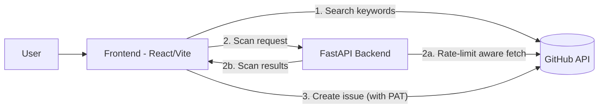
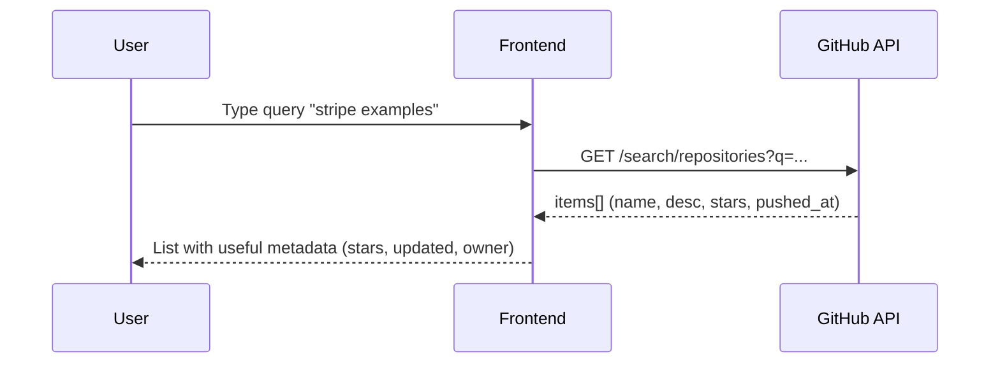
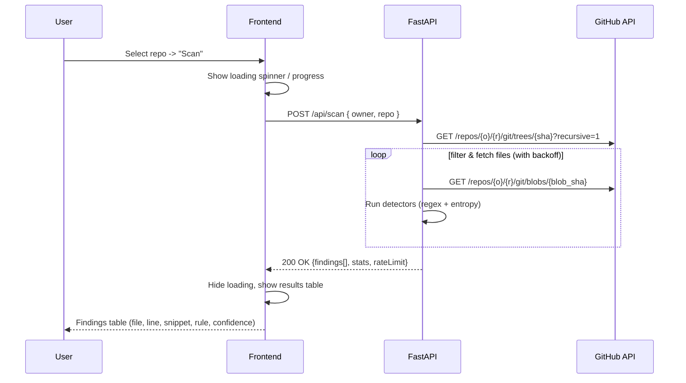
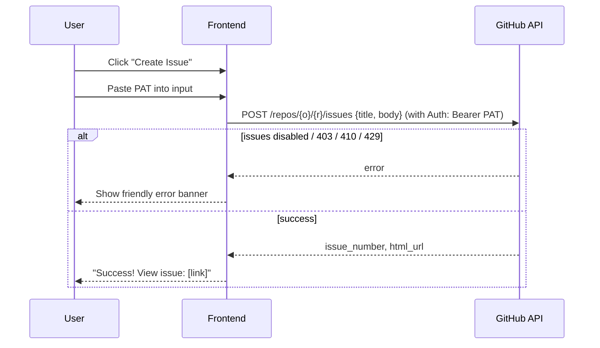

# Blueprint

> **Purpose:** Implement the Frontend and Backend technical tests in a cohesive full-stack solution. We will deliver the *core* requirements robustly within the 2-4 hour scope, documenting key trade-offs (like sync vs. async).

-----

## 0\. Objectives & Constraints

* **Core (2-4 Hour Scope)**
    1. Search public repos by keyword (GitHub).
    2. Scan a selected repo for potential secrets (synchronous API call).
    3. Optionally create a GitHub issue summarizing findings (from frontend).
* **Non-functional**: Graceful rate-limit handling, clear UX, secure token handling (no server-side persistence), simple tests, readable commit history.
* **Optional** (Time-Permitting): Queued async scans, GitHub OAuth, public hosting.

-----

## 1\. High-Level Architecture

* **Frontend**: React + Vite + TypeScript. Manages all GitHub API calls.
    1. Calls GitHub API directly for `repo search`.
    2. Calls our FastAPI for `repo scanning`.
    3. Calls GitHub API directly for `issue creation`.
* **Backend**: FastAPI (Python). Provides **one** core service: scanning. It centralizes the heavy-lifting logic: rate-limit aware repo traversal, file fetching, and running secret detectors.
* **GitHub APIs**: REST v3 (Search, Repos, Trees, Blobs, Issues).

<!-- end list -->



**Key Decision: Why this split?**

* **Security:** The user's GitHub PAT **never** touches our backend server. The frontend sends it directly to GitHub for issue creation. This is the most secure model and simplifies our API.
* **Simplicity:** The backend has one job: scan. The frontend orchestrates the user's flow.

-----

## 2\. User Flows & Sequences

### 2.1 Flow 1: Search Repositories



### 2.2 Flow 2: Scan Repository (Core Sync Flow)



### 2.3 Flow 3: Create Issue



-----

## 3\. API Design (FastAPI)

For our core implementation, the API is extremely simple.

### 3.1 Endpoints

* `POST /api/scan`
  * **Action:** Synchronously scans a repo and returns findings.
  * **Request Body:** `{ owner: str, repo: str, token?: str }` (Optional `token` can be used to increase GitHub API rate-limits for the scan).
  * **Success (200):** `ScanResponse` (see model below).
  * **Error (4xx/5xx):** `{ "detail": "Human-readable error" }`

### 3.2 Models (Pydantic)

```python
# models.py
from pydantic import BaseModel, Field
from typing import List, Literal, Optional

class ScanRequest(BaseModel):
    owner: str
    repo: str
    token: Optional[str] = None # Optional PAT to increase scan rate-limit

class Finding(BaseModel):
    file_path: str = Field(..., alias="filePath")
    line: int
    snippet: str
    rule_id: Literal["regex", "entropy", "keyword"] = Field(..., alias="ruleId")
    confidence: Literal["low", "medium", "high"]

class ScanStats(BaseModel):
    files_scanned: int = Field(..., alias="filesScanned")
    files_skipped: int = Field(..., alias="filesSkipped") # e.g., binaries, large files
    duration_ms: int = Field(..., alias="durationMs")

class RateInfo(BaseModel):
    remaining: int
    reset_at: int = Field(..., alias="resetAt") # UTC timestamp

class ScanResponse(BaseModel):
    stats: ScanStats
    findings: List[Finding]
    rate_limit: RateInfo = Field(..., alias="rateLimit")
```

-----

## 4\. Secret Detection Heuristics

We will implement a multi-layered approach to balance accuracy and performance.

1. **File Filtering:**
      * **Deny list (ext):** Skip binary/media extensions (`.png`, `.jpg`, `.zip`, `.mp4`, etc.).
      * **Deny list (path):** Skip known test/fixture paths (`/test/`, `/fixtures/`, `package-lock.json`).
      * **Size limit:** Skip files \> 1MB to prevent performance issues.
2. **Detection Rules (per file):**
      * **Regex:** A list of common patterns (AWS, Stripe, Slack, `ghp_...`).
      * **Entropy:** Calculate Shannon entropy for strings 20-100 chars. A high entropy (e.g., \> 4.5) suggests randomness, like a key.
      * **Keywords:** Check for keywords (`api_key`, `secret`, `password`, `token`) near a potential match.
3. **Confidence Scoring:**
      * **High:** Strong regex match (e.g., `AKIA...`) + keyword proximity. OR High entropy + keyword proximity.
      * **Medium:** Strong regex match alone. OR High entropy alone.
      * **Low:** A weaker, generic regex match (e.g., long alphanumeric string).

-----

## 5\. Rate-Limit & Resilience

* **Backend:** Our `httpx` client will:
    1. Read `X-RateLimit-Remaining` and `X-RateLimit-Reset` on *every* response from GitHub.
    2. If `Remaining` \< 10, `await asyncio.sleep()` until the `Reset` time.
    3. Respect `Retry-After` headers on 403/429 responses.
    4. Return the *current* rate-limit info (`RateInfo`) to the frontend in the `ScanResponse` so the user has context.
* **Frontend:**
    1. Clearly display rate-limit info.
    2. Handle `429 Too Many Requests` from our *own* API or GitHub with a clear error message.

-----

## 6\. Security

* **PAT Handling:** The GitHub PAT for issue creation is **handled 100% on the frontend**. It is held in component state (memory) and sent *directly* to `api.github.com`. It **never** touches our backend API.
* **CORS:** The FastAPI backend will be configured with CORS to *only* accept requests from our deployed frontend's origin (and `localhost:3000` for dev).
* **Logging:** We will ensure we do not log file contents or any PATs that are (optionally) passed for scanning.

-----

## 7\. Project Structure

```text
repo-root/
  README.md         <- This document
  /frontend
    vite.config.ts
    package.json
    /src
      App.tsx
      /components
        RepoSearch.tsx
        ScanPanel.tsx
        FindingsTable.tsx
        CreateIssueModal.tsx
      /lib
        githubApi.ts     # Handles search and issue creation
        backendApi.ts    # Handles /api/scan calls
      /types
        index.ts         # Types for Findings, ScanResponse, etc.
  /backend
    main.py           # FastAPI app, CORS, /api/scan endpoint
    scanner.py        # Core scan logic, detectors, tree traversal
    github_client.py  # httpx client, rate-limit handling
    models.py         # Pydantic models
    requirements.txt
    .env.example
```

-----

## 8\. Tests (Core)

* **Backend (Pytest):**
  * `test_scanner.py`: Unit test detection logic.
    * `test_regex_finds_aws_key()`
    * `test_entropy_finds_random_string()`
    * `test_filter_skips_binary_file()`
  * `test_main.py`: Integration test the endpoint (using `httpx_mock`).
    * `test_scan_endpoint_returns_findings()`
    * `test_scan_handles_404_repo_not_found()`
* **Frontend (React Testing Library):**
  * `RepoSearch.test.tsx`: Test that typing in the box and clicking search calls the API.
  * `FindingsTable.test.tsx`: Test that passing a list of mock findings renders a table.
