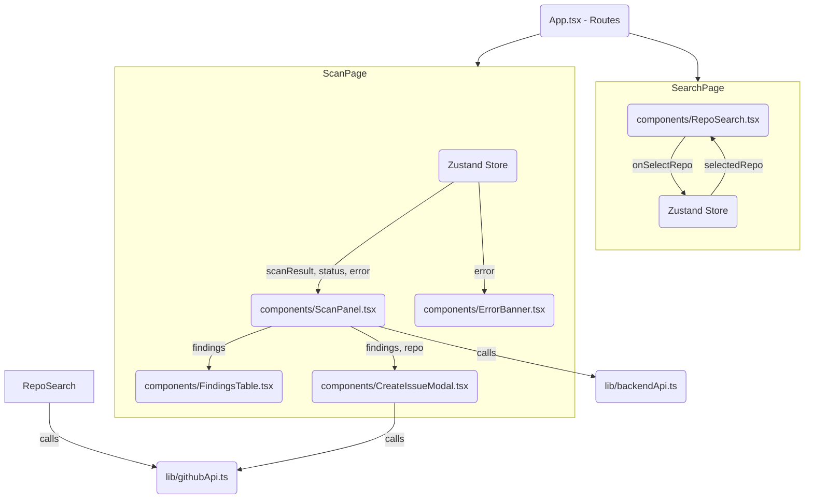
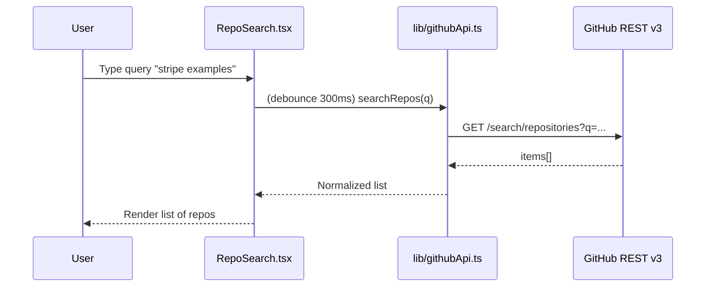
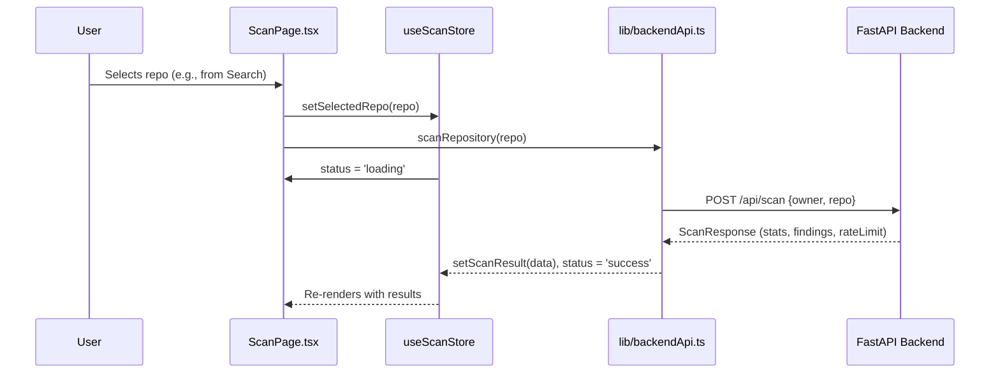
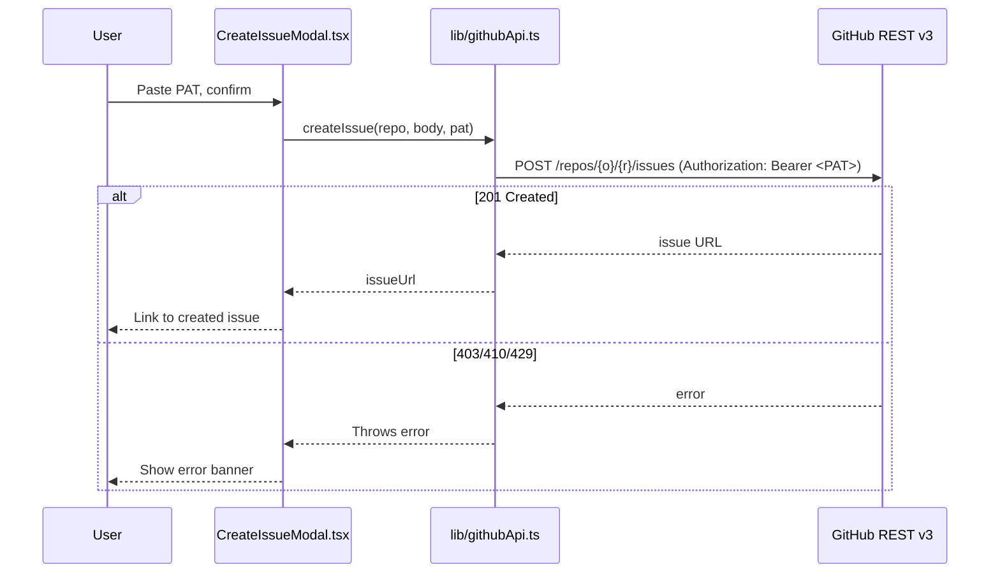

# Frontend Architecture

> Internal reference for maintainers and reviewers.
> This document details the modular structure and interaction between frontend components, built to be **predictable, testable, and fast** with React + Vite + TypeScript.

## 1\. Design Philosophy

We will keep the frontend **thin** and **composable**:

1. **API Layer (`/lib/api.ts`)**: Tiny, typed wrappers around our backend (`/api/scan`) and the GitHub API (`/search/repositories`, `/repos/{o}/{r}/issues`). No UI logic.
2. **State Layer (`/state/useScanStore.ts`)**: Minimal global state (using **Zustand**). It's simple, lightweight, and avoids prop-drilling. Ephemeral UI state (e.g., input text) will live inside components.
3. **UI Layer (`/components/*`)**: Small, testable components. They will receive data via props and send events via callbacks.
4. **Routing (`react-router-dom`)**: We will use routing to manage our app's "pages" (e.g., Search vs. Scan).
5. **Types (`/types/index.ts`)**: TypeScript types will mirror our backend's Pydantic aliases (camelCase) to avoid data mapping.

-----

## 2\. App Structure

```dir
frontend/
├── index.html
├── vite.config.ts
└── src/
    ├── main.tsx
    ├── App.tsx                     # Routes + layout shell
    ├── routes/
    │   ├── SearchPage.tsx          # Repo search + selection
    │   └── ScanPage.tsx            # Scan trigger + results view
    ├── components/
    │   ├── RepoSearch.tsx          # Input + results list
    │   ├── ScanPanel.tsx           # Header meta + scan button + stats
    │   ├── FindingsTable.tsx       # Sortable table of findings
    │   ├── ConfidenceBadge.tsx     # Color-coded badge
    │   ├── ErrorBanner.tsx         # 404/429/5xx friendly messages
    │   └── CreateIssueModal.tsx    # Issue preview + PAT input
    ├── lib/
    │   ├── backendApi.ts           # Fetcher for our /api/scan
    │   ├── githubApi.ts            # Fetchers for GH search and issue creation
    │   ├── types.ts                # ScanResponse, Finding, etc.
    │   └── issueTemplate.ts        # Helper to build the Markdown issue body
    └── state/
        └── useScanStore.ts         # Zustand store (selectedRepo, scanResult, status)
```

-----

## 3\. Component & State Flow



-----

## 4\. UI Flows (Sequences)

### 4.1 Search Repositories



### 4.2 Scan Selected Repository



### 4.3 Create Issue (Frontend -\> GitHub)



-----

## 5\. Data Contracts (Types)

These types in `lib/types.ts` will mirror the backend JSON (camelCase).

```ts
// GitHub API response for search
export interface GitHubRepo {
  full_name: string;
  owner: { login: string };
  name: string;
  stargazers_count: number;
  updated_at: string;
  description: string;
}

// Our internal, simplified repo object
export interface RepoLite {
  owner: string;
  name: string;
  fullName: string; // "owner/name"
  stars: number;
  updatedAt: string; // ISO
}

// --- Backend API Types ---

export type Confidence = 'low' | 'medium' | 'high';

export interface Finding {
  filePath: string;
  line: number;
  snippet: string; // Redacted by backend
  ruleId: 'regex' | 'entropy';
  confidence: Confidence;
}

export interface ScanStats {
  filesScanned: number;
  filesSkipped: number;
  durationMs: number;
}

export interface RateInfo {
  remaining: number;
  resetAt: number; // epoch seconds
}

export interface ScanResponse {
  stats: ScanStats;
  findings: Finding[];
  rateLimit: RateInfo;
}

// --- State Management Types ---

export type ScanStatus = 'idle' | 'loading' | 'success' | 'error';

export interface ScanError {
  message: string;
  status?: number; // 404, 429, etc.
}
```

-----

## 6\. API Layer (lib/)

* **`lib/backendApi.ts`**:
  * `scanRepository(owner: string, repo: string): Promise<ScanResponse>`
    * Calls our backend `POST /api/scan`.
    * Will throw a structured `ScanError` on 404/429/500s.
* **`lib/githubApi.ts`**:
  * `searchRepos(query: string): Promise<RepoLite[]>`
    * Calls GitHub `GET /search/repositories`.
    * Normalizes the full `GitHubRepo` object to our simpler `RepoLite`.
  * `createIssue(repoFullName: string, body: string, pat: string): Promise<string>`
    * Calls GitHub `POST /repos/{o}/{r}/issues` directly.
    * Returns the `html_url` of the new issue.
* **`lib/issueTemplate.ts`**:
  * `buildIssueBody(findings: Finding[]): string`
    * A helper function that builds the Markdown body for the GitHub issue.

-----

## 7\. State Model (Zustand)

`state/useScanStore.ts` will manage our simple global state.

```ts
interface ScanState {
  selectedRepo: RepoLite | null;
  scanResult: ScanResponse | null;
  status: ScanStatus;
  error: ScanError | null;

  // Actions
  selectRepo: (repo: RepoLite) => void;
  startScan: (repo: RepoLite) => Promise<void>;
  clearScan: () => void;
}
```

* **`selectRepo`**: Sets the repo, clears old results, and navigates to the Scan page.
* **`startScan`**: The main action. It sets `status='loading'`, calls `backendApi.scanRepository`, and then updates the store with `scanResult` (on success) or `error` (on failure).

-----

## 8\. UX & Accessibility

* **Loading**: spinners/skeletons on search results and scan panel.
* **Empty states**: “Type to search”, “No secrets found”.
* **Error banners**:

  * 404: “Repository not found.”
  * 429: “Rate limit exceeded. Try again after *{relative time}*.”
  * 5xx: “Upstream error, please retry.”
* **Keyboard**: reachable controls; Enter to search; Esc to close modal.
* **A11y**: labels for inputs, `aria-live="polite"` for status updates, focus management after async transitions.

-----

## 9\. Testing Strategy

* **Unit Tests (Vitest + React Testing Library)**:
  * `RepoSearch.tsx`: Test that typing and clicking calls `searchRepos`.
  * `FindingsTable.tsx`: Test that it renders "No secrets" message when findings are empty.
  * `ConfidenceBadge.tsx`: Test that it has the correct color for `high` vs. `low`.
  * `lib/issueTemplate.ts`: Test that `buildIssueBody` produces correct Markdown.
* **Integration Tests**:
  * `ScanPage.tsx`:
    * Mock the `backendApi.ts` module.
    * Test the full flow: "loading" state shows, "success" state renders `FindingsTable`, and "error" state renders `ErrorBanner`.
  * `CreateIssueModal.tsx`:
    * Mock `githubApi.ts`.
    * Test that clicking "Create" calls `createIssue` with the PAT and body.
    * Test that the 403 (Bad PAT) error is handled.

-----

## 10\. Key Decisions & Trade-offs

* **Zustand vs. React Context**: We're using Zustand. It's minimal, fast, and avoids the boilerplate of Context providers, making our tests cleaner.
* **Search vs. Scan by URL**: The brief includes "Search by keyword." We will implement this as it's a core frontend requirement. We'll skip "Scan by URL" as "Search" provides a better user flow (select from a list).
* **Security**: The PAT for issue creation is **never** stored. It's held in component state (`useState`) within `CreateIssueModal.tsx` and is gone as soon as the modal is closed.
